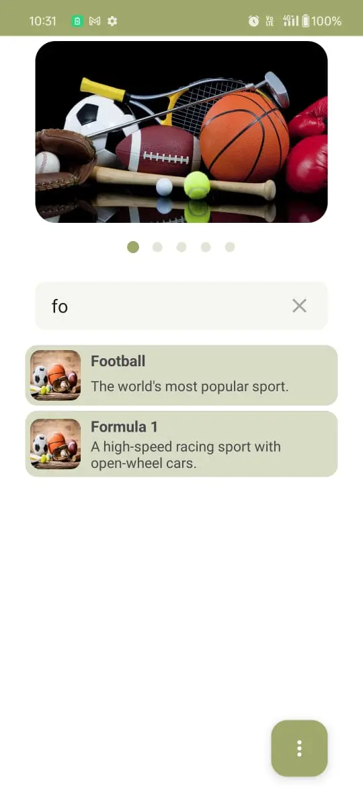

Welcome to the Carousel App! This application provides a comprehensive overview of various categories, including Sports, Plants, Food, Shoes and Countries. It is designed to offer detailed information and a user-friendly experience for browsing through these categories.

# Features

1.	**Top Carousel**
      •	Displays the current Carousel type (e.g., Sports, Plants, Food, Shoes and Countries).
      •	Changing the carousel updates the list items and Carousel type.
2.	**Search Functionality**
      •	Allows users to search within the Carousel range.
      •	The search box floats and remains accessible when the user scrolls upward, and the top carousel collapses.
3.	**Carousel Analysis**
      •	Users can view the current analysis of a Carousel.
      •	Analysis includes:
      o	Carousel range count.
      o	Maximum three-character occurrence value.

#       Usage

**Carousel Navigation**
•	Scroll through the top carousel to select a different Carousel type.
•	The list items will update according to the selected Carousel.

**Searching the Carousel**
•	Use the search box to find specific items within the Carousel range.
•	The search box will float at the top of the screen when scrolling through the Carousel list.

**Viewing Carousel Analysis**
•	Select the option to view the current analysis of the Carousel.
•	The analysis will display the count of items in the Carousel range and the maximum occurrence of three-character sequences within the Carousel items.

#       Dependencies

This project leverages several Jetpack Compose libraries to build a modern Android UI:

* androidx.core:core-ktx: Provides Kotlin extensions for core Android framework components.
* androidx.viewpager2:viewpager2: Offers an improved version of the ViewPager component, supporting both horizontal and vertical paging. It provides better performance and flexibility with dynamic content.
* com.google.android.material: Supplies a comprehensive set of Material Design components and styles, such as buttons, text fields, snackbars, and dialogs, to build visually appealing and consistent UIs.
* androidx.constraintlayout:constraintlayout: Enables the creation of complex layouts with a flat view hierarchy by using constraint-based positioning. This layout manager helps reduce the need for nested view hierarchies, improving performance and making it easier to design responsive and adaptable UIs.

#       Screenshots

Screenshots :

